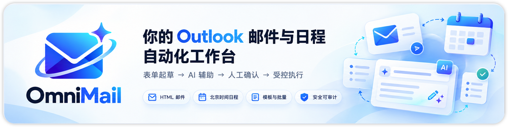
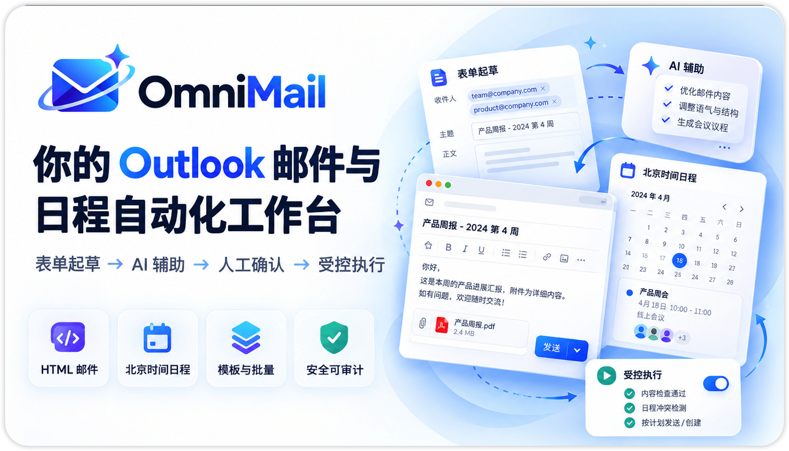

## 这东西是干嘛的？

众所周知，学校 / 企业的 Outlook 邮箱（尤其是教育租户）普遍**禁用 SMTP**。Python `smtplib`、`nodemailer`、`mutt`——这些方案在第一次握手时就会阵亡。你手里唯一的自动化通道，是 Power Automate 里已经配好的那个 Flow，但它对外只剩一个裸 HTTP Webhook：没有起草界面，没有审核，没有批量，没有状态追踪。`curl` 一下，邮件就发出去了；`curl` 错了，邮件**也发出去了**。

> [!Warning]
>
> 当然如果你连这个 Power Automate 都没有，请下载 assests/ 目录下的两个压缩包并导入，这里有我配置好的工作流。
>
> 只需要绑定你的邮箱，就可以直接获得相关的网址，然后填进去就行。

群发个性化通知则是另一场灾难。给 200 个报名者逐个改「姓名 / 时间 / 岗位」再发送，是一场必然出错的重复劳动：抄错邮箱、漏改占位符、正文贴错人——而发出去的邮件**无法撤回**。更别提 Outlook 的 HTML 渲染和浏览器差异大得像两个时代的产品，你精心调的排版到了收件人那里可能完全不是那个样子。




所以我做了这个。**OmniMail** 是一个自托管的 Outlook 邮件与日程自动化工作台。它在你的 Webhook 之上补齐整个工作台——结构化表单、模板版本、批量个性化、任务队列、逐条结果——最后一步才调用你已有的 Flow 发送 HTML 邮件和创建北京时间日程。就这么简单。

## 能干什么

OmniMail 目前支持：

* 邮件 / 日程草稿：TinyMCE 富文本与 HTML 源码双模式编辑，隔离预览可切换电脑（1024px）与手机（390px）视口
* 批量邮件合并 / 批量日程：CSV / Excel 名单导入，`{{ 字段 }}` 占位符逐行渲染，任何一行有问题整批都不发送
* 模板库：版本管理与一键回滚，Agent 也能查询 / 应用 / 修改模板
* AI Agent：多轮对话起草、上传参考文件、SSE 流式展示真实处理过程
* 发送测试邮件：先把一份样本发到自己邮箱，在真实 Outlook 里确认渲染，再处理整批
* 串行限速执行（默认 1 秒 / 条，可调）、任务历史、逐条结果与状态追踪
* Passkey 登录：无密码、无账号体系，已登记凭证共享工作空间
* 可鉴权的 MCP 服务，让可信客户端（比如 Claude Code）直接排队任务

简单来说：**AI 可以帮你写信，但点「发送」的永远是你**。

## 大概是怎么跑的

```text
┌─────────────┐   Passkey 登录（无账号体系，已登记凭证共享工作空间）
│  浏览器 SPA  │──AI 起草（SSE 流式）──▶ AI Provider（OpenAI / Anthropic / GLM…）
│  Vue 3 前端  │
└──────┬──────┘
       │ 同源 REST /api（HttpOnly 会话 + CSRF）
┌──────▼──────────────────────────────────────────┐
│  Fastify 后端（TypeScript）                       │
│  SQLite（WAL）：配置/模板版本/任务/凭证/审计        │
│  串行 worker：限速 → 重启恢复 → 状态分级            │
└──────┬──────────────────────────────┬───────────┘
       │ 人工确认后调用                  │ Bearer API Key
┌──────▼──────────┐          ┌────────▼────────┐
│ Power Automate   │          │ MCP 客户端       │
│ 邮件 / 日程 Flow │          │ POST /mcp       │
└─────────────────┘          └─────────────────┘
```

| 层 | 技术 |
| --- | --- |
| 前端 | Vue 3 · TypeScript · Vite · Tailwind CSS 4 · shadcn-vue（Reka UI / TinyMCE） |
| 后端 | Fastify · TypeScript · Zod · OpenAI / Anthropic SDK |
| 数据库 | SQLite（WAL 模式，就一个文件） |

两个 Flow 的导出包存放在 [`assests/`](assests/)（原样 zip，可直接导入 Power Automate 参考）。另外，协议外层的 `attachments` 字段是 Adaptive Card 信封，**不是**邮件附件——别被名字骗了。

## 为什么 HTTP 200 不等于发送成功？

Power Automate 返回 2xx 只代表 Flow 收下了请求，不代表 Outlook 真的发出、更不代表对方收到。超时、5xx、网络中断时你根本不知道副作用有没有发生——这时候盲目重试，就是重复群发。

所以 OmniMail 把任务状态严格分级：`accepted`（接口确定接收）/ `uncertain`（结果不确定，先查 Flow 运行历史）/ `failed`（确定未被接受）。**不确定的请求永远不会被自动重试**；服务器重启时正在执行的条目也会自动转为不确定。宁可让你多查一步 Flow 历史，也不替你赌一把。

## AI 很会写信，但它没有发送权

把发件通道直接交给 AI 是不可接受的。所以 Agent 手里只有 23 个「读与改」的业务工具——草稿、模板、映射、校验——**没有任何发送、确认或排队工具**。

它可以操作全部邮件字段（收件人、抄送、密送、主题、正文）及日程字段（必选 / 可选参会者、主题、起止时间、地点、正文），也可以设置批量占位符映射和收件人列。默认起草建议只是「尚未应用」的提案，预览所有字段后点一下才写入；明确要求修改当前草稿时，工具直接修改对应字段，未指定的字段保持不变。无论哪种方式，发送仍需你在审核弹窗里勾选「我已审核收件人及整批内容，同意执行」后亲自完成。完整名单也不会塞进模型输入，模型按需读取指定行——你的收件人数据不会整包曝光给 AI 服务商。

## MCP 服务

标准 Streamable HTTP MCP：`POST <站点地址>/mcp`，Header 带 `Authorization: Bearer <API_KEY>`。密钥在「MCP」页创建（`omni_` 前缀，仅创建时显示一次，服务端只存 SHA-256 摘要）。客户端配置示例：

```json
{
  "mcpServers": {
    "omnimail": {
      "url": "https://你的域名/mcp",
      "headers": { "Authorization": "Bearer <YOUR_API_KEY>" }
    }
  }
}
```

| 工具 | 行为 |
| --- | --- |
| `send_email` | 立即创建并**排队**邮件任务（可携带 ≤1000 行数据做批量渲染） |
| `create_event` | 立即创建并**排队**日程任务 |
| `get_task` | 查询任务状态与逐条结果 |
| `list_templates` | 获取模板列表 |

> [!WARNING]
>
> MCP 的发送 / 邀请**不经 Web 人工确认**——API Key 即执行权限。只向可信客户端授权；密钥不得进入前端源码、公开仓库或日志。

## 一个很重要的事情

* Webhook URL 是 bearer 级密钥：AES-256-GCM 加密存储，界面只显示「已配置 / 未配置」，永不回显。
* 所有不可信 HTML（预览、历史正文、AI 建议预览）都渲染在 `sandbox` iframe + CSP 里：禁脚本、禁外链、仅允许 data: 图片。
* 取消任务只停未执行的条目，已发出的邮件**不撤回**。
* 无送达回执：`accepted` 只代表接口接收，最终送达请到 Outlook / Flow 侧核实。
* `SETUP_TOKEN` 同时是恢复通道：持有者可以在**未登录**状态注册新 Passkey（该路径同样受 30 次/分/IP 限速保护），请像保管 `APP_SECRET` 一样保管它。
* 登录、凭证增删、设置变更、模板版本、任务确认全部落审计日志。

## 本地开发

要求 Node.js 22+。

```bash
npm ci
npm --prefix frontend ci
cp .env.example .env
# 用 openssl rand -hex 32 分别生成 APP_SECRET 与 SETUP_TOKEN 填入 .env
set -a; source .env; set +a
npm run dev
```

前端跑在 `http://localhost:5173`（`/api` 与 `/mcp` 已代理到后端 3000 端口），后端监听 `127.0.0.1:3000`。首次打开站点会要求用 `SETUP_TOKEN` 注册第一把 Passkey，之后登录无密码。Passkey 绑定认证器——换了设备登不上时，在登录页点「使用 SETUP_TOKEN 注册新 Passkey」即可自救。

环境变量一览（`.env.example`）：

| 变量 | 说明 |
| --- | --- |
| `APP_SECRET` | 加密主密钥，≥32 字符；**丢失则所有已存配置无法解密** |
| `SETUP_TOKEN` | Passkey 注册令牌，≥24 字符：初始化第一把 Passkey 用它，未登录时注册新 Passkey（比如换了设备登不上）也用它 |
| `APP_ORIGIN` | 站点地址，开发用 `http://localhost:5173`；**生产必须 HTTPS** |
| `HOST` / `PORT` | 后端监听地址，默认 `127.0.0.1:3000` |
| `DATABASE_PATH` | SQLite 路径，默认 `data/omnimail.sqlite` |

其他常用命令：`npm test`（内存 SQLite + 模拟 HTTP，绝不调用真实邮件 / AI）、`npm run lint`、`npm run build`。需求全量见 `docs/PRD.md`，验收记录见 `docs/VERIFICATION.md`。

## 部署

生产必须 HTTPS（Passkey 与 Cookie 安全的前提）：

```bash
# .env: APP_ORIGIN=https://你的域名，以及独立随机的 APP_SECRET / SETUP_TOKEN
docker compose up -d --build   # 容器监听 127.0.0.1:3000，数据卷 omnimail-data 必须持久化
```

再用 Caddy / Nginx 把 HTTPS 反代到 `127.0.0.1:3000`：

```caddyfile
mail.example.org {
  reverse_proxy 127.0.0.1:3000
}
```

不想用 Docker 的话，`./deploy.sh` 一条命令：安装依赖 → 构建 → 用 PM2 拉起**单个**进程 `dist/server/index.js`，同端口托管前端静态文件、`/api` 与 `/mcp`。进程名（`PM2_APP_NAME`，默认 `omnimail`）、监听地址（`HOST` / `PORT`）都在 `.env` 里配；反代域名需与 `APP_ORIGIN` 一致。

几条运维约束：**单实例单 worker**（SQLite WAL 模式，不要多副本共享数据库并行执行任务）；备份必须同时包含数据库文件与 `APP_SECRET`，缺一不可解密；换域名等于换 Passkey RP ID，所有凭证需重新绑定。

## 最后

这个项目没有什么宏大的目标。最开始只是因为：

> **我只是想安全地群发一封通知，为什么要把自己暴露在裸 Webhook 面前？**

如果它顺便也帮你少 `curl` 了几次 Webhook、少复制粘贴了几百遍姓名，那挺好，请礼貌给 star。

---

Made with ❤️ by GentleLijie
